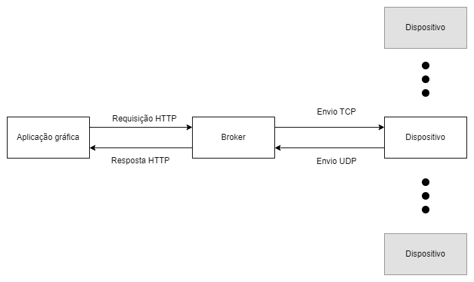

# 0. Passo a passo para execução (FEITO)
### 0.1 Criação dos containers
Para criar o sistema de maneira isolada no seu computador, execute o comando abaixo no seu terminal, estando na pasta raiz do projeto. O comando irá criar um container para o Broker e 4 containers para os dispositivos.   
```
$ docker-compose up
```
### 0.2 Iniciando os dispositivos
**Passo 1:** Uma vez criado os containers, não será necessário iniciar o container do Broker, pois o mesmo já estará sendo executado. Entretanto, os dispositivos necessitam serem iniciados manualmente, devido a sua caracteristica interativa. Primeiro obtenha o nome dos containers de cada dispositivo (são todos os iniciados com "concorrencia-conectividade-device") com o  comando abaixo.
```
$ docker ps
```
**Passo 2:** Agora você deve entrar em cada um dos containers que são referentes a dispositivos. Execute o comando abaixo.
```
$ docker exec -it <ID ou nome do contêiner> bash
```
**Passo 3:** Já no terminal do container do dispositivo, você deve executar o comando abaixo para iniciar o dispositivo.
```
$ python main.py
```
**Passo 4:** Repita os passos 2 e 3 para todos os containers de dispositivos. 

### 0.3 Iniciando a aplicação gráfica
Para executar a aplicação gráfica é preciso navegar até a pasta da mesma e executar o arquivo python principal, para isso execute os comandos abaixo. 
```
$ cd aplicacaoGF/ 
$ python main.py
```

# Explicação da organização do código
Cada pasta possui um dos elementos do sistema a ser desenvolvido, sendo eles: a aplicação gráfica, o middleware e o dispositivo. Na figura abaixo é possível ver como se dá a relação de comunicação entre os mesmos.



A aplicação deve requisitar os dados que precisa ao Broker, por meio de requisições HTTP que foram expostas pela API Restfull desenvolvida no Broker, sendo eles: os dispositivos conectados no broker e os dados dos dispositivos conectados ao broker. A aplicação, ainda, deve enviar comandos ao Broker por meio de requisições HTTP e tais comandos devem ser repassados aos dispositivos especificados.


O dispositivo não deve saber da existência da aplicação, pois o mesmo só se comunica com o Broker. O dispositvo envia os dados de sua leitura por meio do protocolo UDP para o Broker e deverá receber os comandos, provenientes da aplicação gráfica, por meio do protocolo TCP.

Em 'aplicacaoGF' está o código responsável pelo processo da aplicação gráfica que envia comandos para o broker e requisita dados utilizando o padrão HTTP. 

Em 'dispositivo' tem os arquivos necessários a execução do processo do device. Em 'config.py' tem as infoormações para realizar as comunicações com o broker, como as portas TCp e UDP que o mesmo escuta, bem como seu endereço IPv4. Ainda em 'config.py' há a key que será usada para que o dispositivo consiga se conectar e se autenticar com o broker, e tammbém há o segredo que serve como chave para criptografar os dados que serão enviados e descriptografar os recebidos. Em 'interface.py' estão os arquivos referentes as rotinas executadas na thread que trata do menu ao qual o usuário poderá alterar dados e inserir comandos para o dispositivo. Os arquivos 'myTcpSet.py' e 'myUdpSet.py' tratam das rotinas executadas nas threads que lidam com o protocolo TCP e UDP respectivamente. 'Device.py' apresenta a classe que representa o dispositivo.

Em 'middleware' estão os arquivos referentes ao processo do Broker. Em 'config.py' tem as infoormações para realizar as comunicações com o os dispositivos e a aplicação, como as portas TCp e UDP que o mesmo escuta, bem como os endereços IPv4 que a API Restfull irá permitir receber requisições e os endereços ao qual se aceitará conexões TCP. Ainda em 'config.py' há as informações necessárias para autenticação dos dispositivos e criptografia das informações, bem como apresentado em 'dispositivo'. Os arquivos 'SERVER_TCP.py' e 'SERVER_UDP.py' tratam das rotinas executadas nas threads que lidam com o protocolo TCP e UDp respectivamente. 'Broker.py' apresenta a classe que representa o broker e nele há toda a gerência dos dispositivos conectados e seus respectivos tópicos. Em 'api.py' tem a declaração dos endpoints e tudo o mais relacionado a API Restful, porém fez-se do arquivo o main de todo o processo, então tem-se a iniciação dos sockets e etc.

# 1. Introdução
# 2. Fundamentação Teórica
# 3. Metodologia
## 3.1 Aplicação gráfica
## 3.2 Middleware
### 3.2.1 API Restfull
### 3.2.2 Broker
## 3.3 Device
# 4. Resultados
# 5. Conclusões